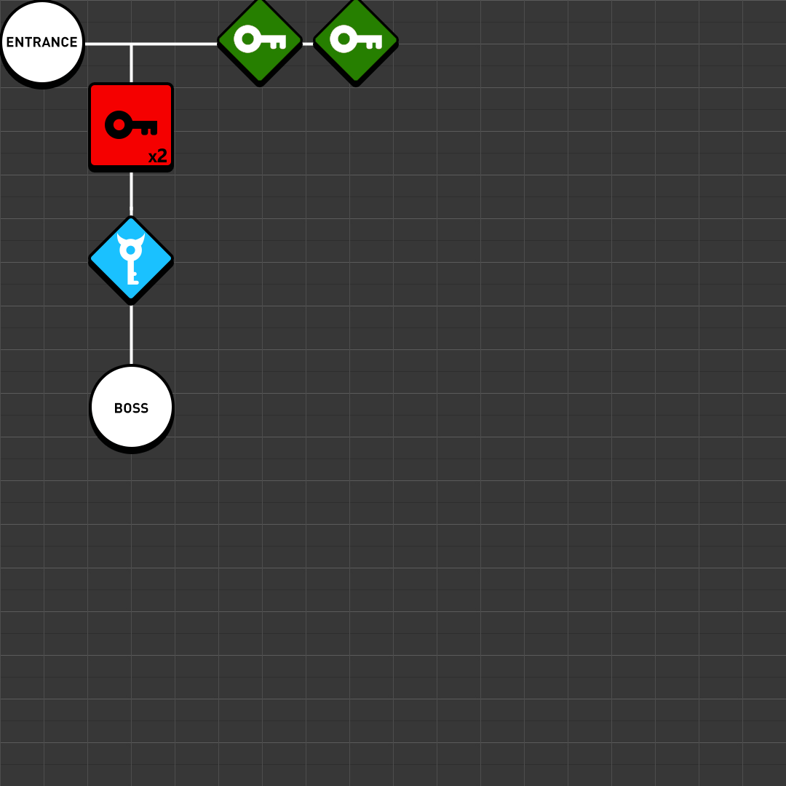

# Dungeon Graphs Solver
Given a set of nodes (a dungeon) with requirements and unlocks, this app finds the sequence of events on how to solve a dungeon in abstract steps. This is based on the A* algorithm
This is the visual representation of the file `dungeons/dungeon-1.json`

This was inspired by the research made by Mark Brown in his series [Boss Keys](https://www.youtube.com/watch?v=ouO1R6vFDBo&list=PLc38fcMFcV_ul4D6OChdWhsNsYY3NA5B2).
